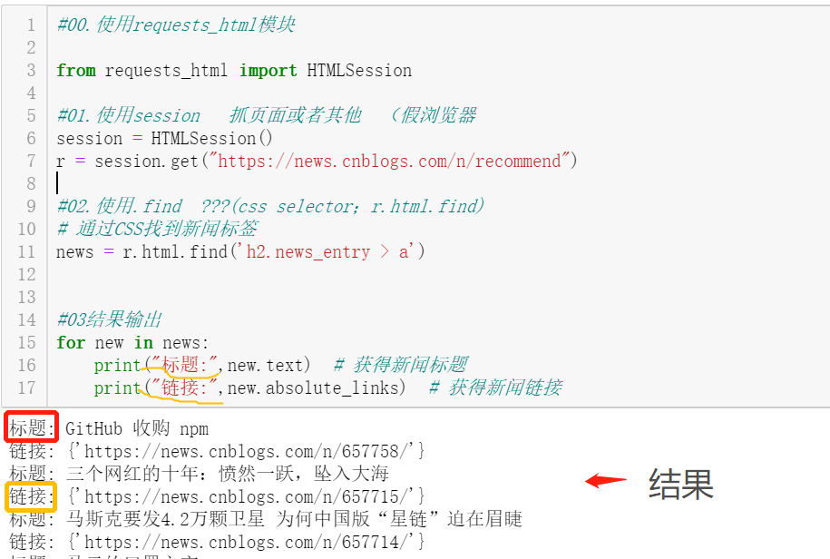
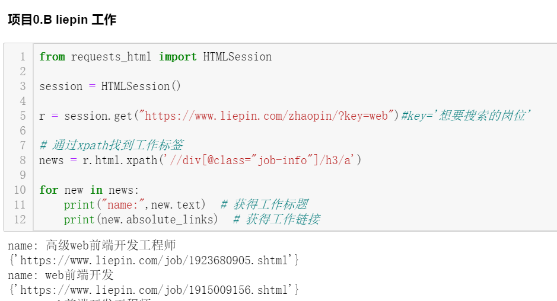

* 想要通过这门专业学到什么？

抓取一些平常弄不了的东西，例如一些需要收费的音乐链接，一些好看的图片等等。也为以后工作打下基础，或许将来会有用处。

本节课学到了什么？

选择器selector抽取数据img，借用HTML的"结构"性(chrome要从页面选到结构)，有两种可能，即

路径---xpath： $x('放这')     --选择你想要搜查的内容，右键点击copy,进而根据需要点击"Copy xpath"，即可得到你所要搜查的xpath[element]

                              通过xpath找到工作标签 news = r.html.xpath('//div[@class="job-info"]/h3/a')
                                        找图片      𝑥("/ℎ𝑡𝑚𝑙/𝑏𝑜𝑑𝑦/𝑚𝑎𝑖𝑛/𝑑𝑖𝑣/𝑑𝑖𝑣/𝑎/𝑖𝑚𝑔")

CSS选择器---CSS： $('放这')
                 
                             通过CSS找到新闻标签  news = r.html.find('h2.news_entry > a')
                                          找图片 ("body > main > div > div > a > img")

以上内容均在console进行搜索

在打代码之前，要做的第一件事是导入所需要的的模块。没有做这一步，后面的均进行不了，除非你本来就有这个模块。

---------

#00.使用requests_html模块

     from requests_html import HTMLSession

#01.使用session   抓取页面（想要分析的页面URL）

     session = HTMLSession()
     
     r = session.get("https://news.cnblogs.com/n/recommend")

#02.使用.find  (css selector；r.html.find) 通过CSS找到新闻标签 -想要抓取的内容

     news = r.html.find('h2.news_entry > a')

#03结果输出

    for new in news:

        print("标题:",new.text)  # 获得新闻标题
    
        print("链接:",new.absolute_links)  # 获得新闻链接
        
---------

通过代码抓取网页图片。

pyter 可用的魔法之一 IPython 展示模块, HTML转码

1.

    from IPython.core.display import display, HTML
    display(HTML(''))

2.

    from IPython.core.display import display, Markdown
    display(Markdown(''))
    
两种方法均可以抓取到图片，并且只能是具体某一张

下面这种方法可以抓取某个网页的所有照片
--------

from requests_html import HTMLSession

session = HTMLSession()

r = session.get("https://cn.bing.com/images/trending")

# 通过xpath找到工作标签
items = r.html.xpath('//img/@src')

for url in items:
    print(url)  # 获得图片src url
    display(Markdown(''.format(url=url)))  # 展示图片    

--------

