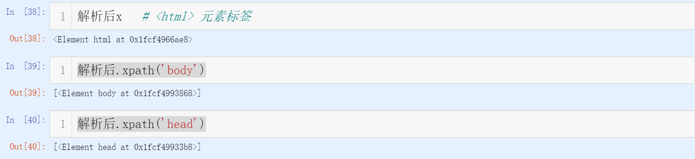

## 熟悉xpath

[ipynb文档](https://github.com/Crayon2/Web_Mining/blob/master/20%E6%98%A5_Web%E6%95%B0%E6%8D%AE%E6%8C%96%E6%8E%98_week02_181013091.ipynb)

本节课对于第一节课而言，注重的是深度的挖掘

除去xpath节点的书写方式，本节课与HTML文本息息相关

* HTML文本的解析

以--解析后.xpath('标签')--这样的形式能够快速找到这个标签位于文档的那个地方。

举例：

除此之外，还有--解析后.xpath('//a')  

greedy 所有<html> 元素标签，即除了普通的标签，还可以省略了父标签的字标签，例如'//a'即是所有标签下的a标签

除去标签，还可以解析路径，爬取到我们想要的信息

* 利用pandas输出表格

下面的是一般的格式

